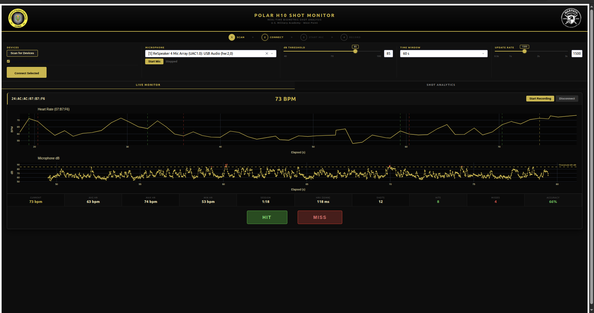
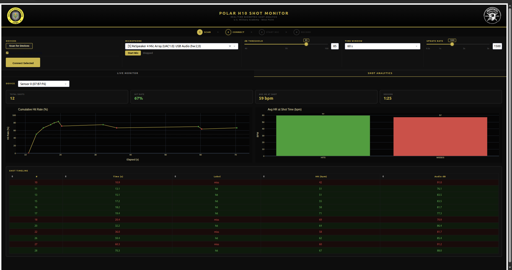

# Polar H10 Shot Monitor

Real-time heart rate and audio shot monitoring for marksmanship performance analysis.
Streams HR from one or more Polar H10 chest straps over BLE, continuously monitors
microphone loudness to detect shot events, and lets an operator label each shot as
hit or miss — all from a live web dashboard. BLE connections auto-reconnect on
drop, and shot analytics (HR, audio dB) persist for the full session.

### Live Monitor


### Shot Analytics


---

## Features

- **Multi-sensor support** — connect up to 4 Polar H10 chest straps simultaneously
- **Real-time HR visualization** — instantaneous heart rate derived from RR intervals, plotted on a shared time axis
- **Audio shot detection** — continuous microphone monitoring with configurable dB threshold to detect shot events
- **Hit/miss labeling** — one-click shot labeling with HR and audio context persisted per label
- **Shot analytics dashboard** — cumulative hit rate, HR at shot comparison (hits vs misses), and sortable shot timeline
- **BLE auto-reconnect** — automatic recovery from Bluetooth connection drops without losing session data
- **CSV logging** — per-beat HR, per-event audio, and per-label shot data exported for offline analysis
- **Docker deployment** — single-command containerized setup with BLE and mic hardware passthrough

---

## Installation

```bash
pip install -r requirements.txt
```

Linux users may need `libbluetooth-dev` for bleak:

```bash
sudo apt install libbluetooth-dev
```

---

## Running the dashboard

```bash
python -m src.dashboard_app
```

Then open `http://localhost:8050` in a browser.

### Docker

```bash
docker compose up --build
# Open http://localhost:8050
```

Requires Docker with a Bluetooth adapter and microphone on the host.
BlueZ must be running on the host (`systemctl status bluetooth`).

**Typical session flow** (follow the step indicator at the top of the dashboard):
1. Make sure the Polar H10 strap(s) are powered on and worn.
2. Click **Scan for Devices** — wait ~8 s for results.
3. Check the device(s) you want and click **Connect Selected**.
4. Select a microphone from the dropdown and click **Start Mic**.
5. Click **Start Recording** on each active sensor card to begin logging.
6. Use **HIT / MISS** buttons to label shots as they occur.
7. Switch to the **SHOT ANALYTICS** tab for detailed performance metrics.
8. Click **Stop Recording** when done.

---

## Where logs go

All CSV files are written to `logs/` with the pattern:

| File | Contents |
|---|---|
| `session_<ADDR>_<TS>.csv` | One row per heartbeat: timestamp, elapsed, RR, HR, audio peak |
| `audio_events_<ADDR>_<TS>.csv` | One row per mic sample that crossed the dB threshold |
| `shot_labels_<ADDR>_<TS>.csv` | One row per labeled shot: time, hit/miss, HR at shot, dB peak, threshold |

---

## Analysis notebook

`notebooks/analysis_basics.ipynb` — load the three CSVs from a session, align
labeled shots to the nearest heartbeat, and plot HR around hits vs misses.

---

## Running tests

```bash
pytest tests/
```

---

## Project layout

```
hr-shot-monitor/
├── src/
│   ├── config.py          # Constants, USMA palette, style dicts, Plotly layout
│   ├── state.py           # Shared runtime state (streamer/logger dicts, mic buffer)
│   ├── polar_stream.py    # PolarH10Stream, BLE scan, connect/disconnect, auto-reconnect
│   ├── audio_stream.py    # Mic capture, dB utilities, spike detection
│   ├── logging_utils.py   # SessionLogger, AudioEventLogger, ShotLabelLogger
│   └── dashboard_app.py   # Dash app (entry point) — two-tab layout with analytics
├── notebooks/
│   └── analysis_basics.ipynb
├── logs/                  # Runtime CSV output (gitignored)
├── assets/                # Logo images + custom.css served by Dash
├── tests/
│   ├── test_rr_to_beats.py
│   └── test_audio_alignment.py
└── docs/
    └── architecture.md    # Signal alignment + code architecture + data schemas
```
## Documentation
- [Architecture & signal alignment](docs/architecture.md)
- [System diagrams](docs/diagrams.md)
