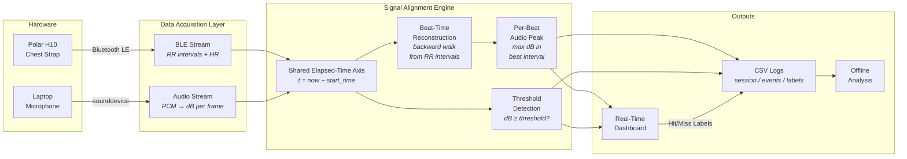
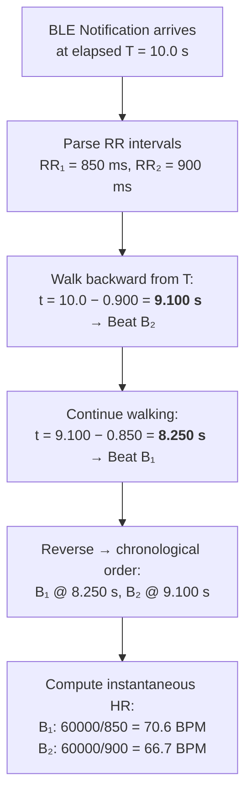
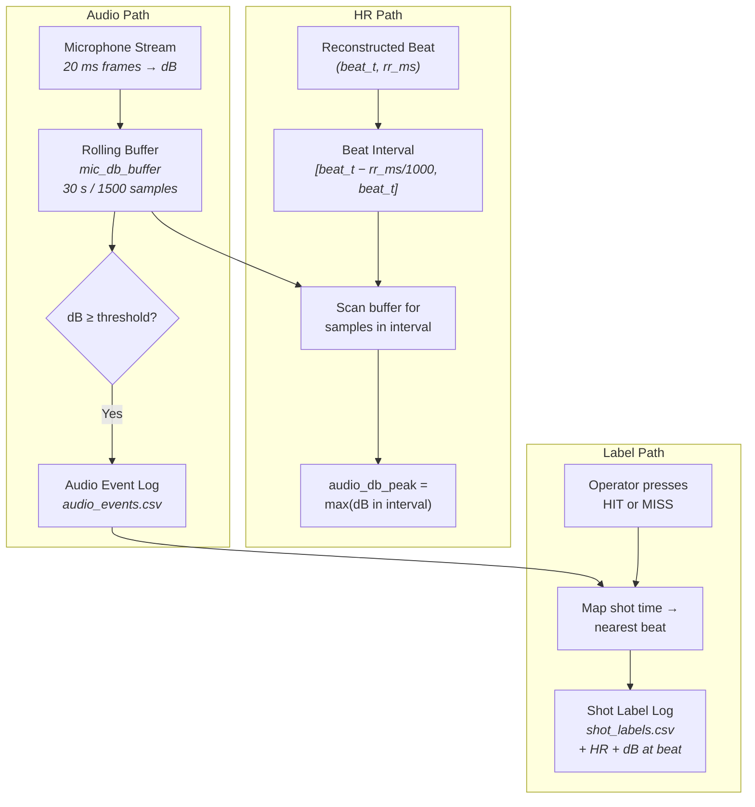
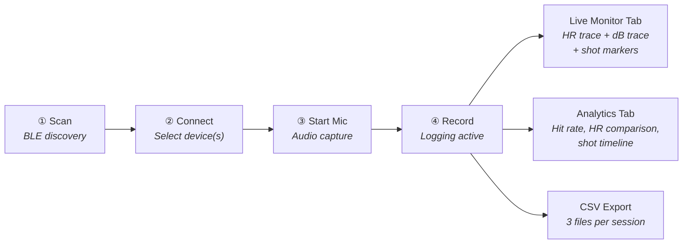
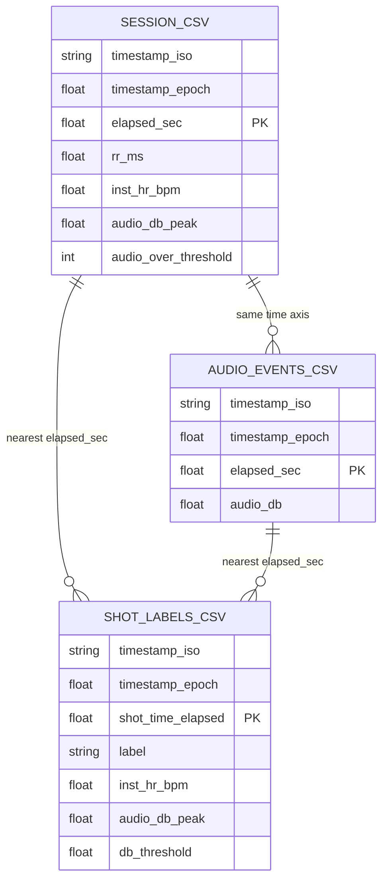
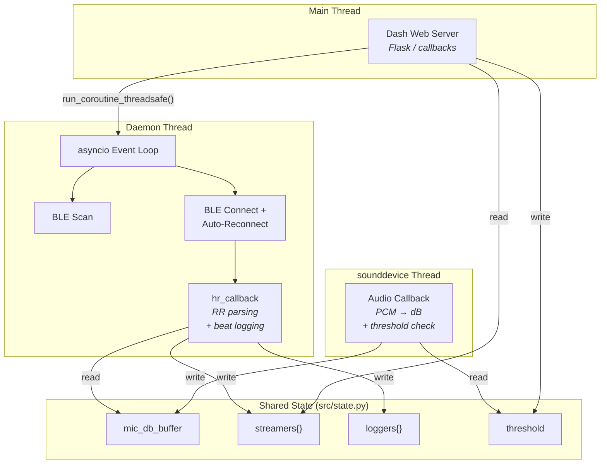

# Capstone Diagrams

Use these with any Mermaid renderer (mermaid.live, VS Code plugin, or export to PNG/SVG for the paper).

---

## Diagram 1 — System Architecture (High-Level Data Flow)

---

## Diagram 2 — Beat-Time Reconstruction from RR Intervals

---

## Diagram 3 — Audio-to-Heartbeat Mapping Pipeline

---

## Diagram 4 — Dashboard Session Workflow

---

## Diagram 5 — CSV Data Schema Relationships

---

## Diagram 6 — Threading & Concurrency Model

